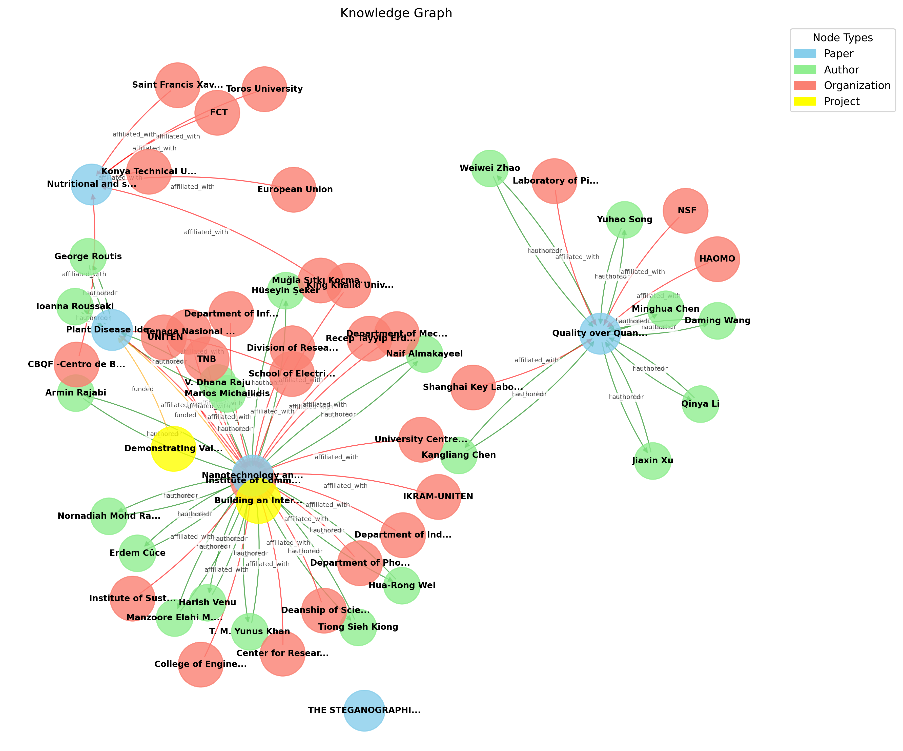

.. Knowledge Graph SQL documentation master file
   Created with sphinx-quickstart on Tue May 27 2025.
   This file should at least contain the root `toctree` directive.

===========================================
Knowledge Graph - Documentación
===========================================

|

.. centered:: **Construcción de Grafos de Conocimiento Académico mediante Procesamiento Inteligente de Documentos PDF**

----

Visión General
==============

**Knowledge Graph SQL** es una plataforma de procesamiento de documentos académicos que transforma artículos científicos en formato PDF en un grafo de conocimiento estructurado y navegable. La aplicación combina técnicas de extracción de información, análisis semántico y visualización interactiva para crear una representación rica de las relaciones entre publicaciones, autores, instituciones y proyectos de investigación.

🎯 **Objetivos Principales**
----------------------------

* **Automatización**: Extracción automática de metadatos desde documentos PDF
* **Enriquecimiento**: Integración con bases de datos académicas externas (OpenAIRE, OpenAlex)
* **Análisis Semántico**: Identificación de similitudes temáticas mediante modelos de IA
* **Visualización**: Interfaces interactivas para exploración de datos
* **Interoperabilidad**: Exportación a formatos estándar (RDF)

🚀 **Características Destacadas**
---------------------------------

✅ **Procesamiento Inteligente de PDFs** usando Grobid
✅ **Análisis Semántico** con modelos de Hugging Face
✅ **Enriquecimiento de Datos** desde APIs académicas
✅ **Visualización Interactiva** con Streamlit y PyVis
✅ **Exportación RDF** para integración con sistemas semánticos

📊 **Casos de Uso**
-------------------

* **Investigadores**: Explorar conexiones entre publicaciones y autores
* **Bibliotecarios**: Catalogar y relacionar colecciones académicas
* **Analistas**: Identificar tendencias y colaboraciones en investigación
* **Desarrolladores**: Integrar grafos de conocimiento en aplicaciones

🔧 **Tecnologías Utilizadas**
=============================

.. list-table::
   :widths: 30 70
   :header-rows: 1

   * - Componente
     - Tecnología
   * - **Extracción PDF**
     - Grobid, PyPDF2
   * - **Análisis Semántico**
     - Hugging Face Transformers, Sentence Transformers
   * - **APIs Externas**
     - OpenAIRE, OpenAlex
   * - **Grafos**
     - NetworkX, RDFLib
   * - **Visualización**
     - Streamlit, PyVis, Matplotlib, Altair
   * - **Machine Learning**
     - PyTorch, Scikit-learn
   * - **Procesamiento**
     - Pandas, NumPy

📋 **Contenido de la Documentación**
====================================

.. toctree::
   :maxdepth: 3
   :caption: 🚀 Primeros Pasos
   :titlesonly:

   introduccion
   instalacion
   quickstart

.. toctree::
   :maxdepth: 3
   :caption: 📖 Guías de Usuario
   :titlesonly:

   uso
   configuracion
   casos_uso

.. toctree::
   :maxdepth: 3
   :caption: 🔬 Análisis y Resultados
   :titlesonly:

   resultados
   visualizaciones
   exportacion

.. toctree::
   :maxdepth: 3
   :caption: 🛠️ Desarrollo
   :titlesonly:

   arquitectura
   api_reference
   contribucion

.. toctree::
   :maxdepth: 2
   :caption: 📚 Referencia
   :titlesonly:

   modules
   glosario
   faq

🎯 **Inicio Rápido**
===================

1. **Instalación con Docker**:

   .. code-block:: bash

      git clone https://github.com/ikerorozco/Knoledge-Graph-sql
      cd Knowledge-Graph-SQL
      docker-compose up --build

2. **Ejecutar la aplicación**:

   .. code-block:: bash

      streamlit run src/app.py

3. **Acceder a la interfaz**: http://localhost:8501

**Versión**: |version| | **Última actualización**: |today|
